# Grafo de conhecimento e protocolo de leitura

## Códigos de nós

| Prefixo | Tipo |
| --- | --- |
| `TM-INS` | identidade, tese, promessa e método |
| `TM-COM` | comercial, ICP, diagnóstico, qualificação e proposta |
| `TM-MID` | mídia, linguagem, territórios e criativos |
| `TM-DOC` | contratos, OS, SLA, políticas e anexos formais |
| `TM-TEC` | repositórios, arquitetura, integrações e código |
| `TM-PUB` | projetos, deploys, domínios e estado publicado |
| `TM-BRD` | logos, variantes visuais e ativos de marca |
| `TM-RSK` | conflito, lacuna, risco ou item não verificável |

## Nós canônicos

| Código | Nó | Função no grafo |
| --- | --- | --- |
| `TM-INS-001` | Definição institucional | Governa o que a Techmarque é. |
| `TM-INS-002` | Tese | Governa a ordem processo → dados → automação → escala. |
| `TM-INS-003` | Método | Governa diagnóstico → implantação → treinamento → governança. |
| `TM-COM-001` | Posicionamento comercial | Governa problema assumido e oferta atual. |
| `TM-COM-002` | ICP rochas ornamentais | Governa prioridade de mercado e tensões do segmento. |
| `TM-COM-003` | Diagnóstico de entrada | Deve governar a entrada comercial; nó atual está vazio. |
| `TM-COM-004` | Rotas comerciais | Organiza possíveis direções após diagnóstico. |
| `TM-COM-005` | Proposta técnica | Registra direção e estimativa; não fecha escopo. |
| `TM-DOC-001` | OS/contrato/SLA | Decide escopo, aceite, responsabilidade e suporte no caso concreto. |
| `TM-MID-001` | Papel da mídia | Governa a função estratégica da comunicação. |
| `TM-MID-002` | Territórios | Governa leitura aplicada, sistema em operação e visão institucional. |
| `TM-MID-003` | Creative Director | Executa o protocolo de decisão criativa e o quality gate. |
| `TM-TEC-001` | Techmarque Nexus | Prova portal, operação documental e capacidade de integração. |
| `TM-TEC-002` | Régua | Prova SaaS, agendamento, assinatura e governança de acesso. |
| `TM-TEC-003` | AbrasiHub | Prova produto vertical, dados, billing, analytics e segurança. |
| `TM-TEC-004` | Comanda Flow | Prova frontend, API, multi-tenant e operação de produto. |
| `TM-PUB-001` | Vercel Techmarque | Registra cinco projetos, domínios e deploys de produção. |
| `TM-BRD-001` | Inventário de logos | Registra seis variantes fornecidas, dimensões, opacidade e regras de uso. |
| `TM-RSK-001` | Contexto histórico de 2025 | Desatualizado; não deve governar posicionamento atual. |
| `TM-RSK-002` | Cobertura parcial de repositórios | Impede afirmar equivalência entre repositórios Comanda Flow. |
| `TM-RSK-003` | Arquivos `.env` indexados | Exige verificação de segurança sem expor valores. |

## Grafo de autoridade

```mermaid
flowchart LR
    A["Pedido ou decisão"] --> B["Identificar o fluxo afetado"]
    B --> C["Notion: nó que governa"]
    C --> D["Drive: nó que registra ou formaliza"]
    D --> E["GitHub: capacidade técnica real"]
    E --> F["Vercel: estado publicado"]
    F --> G["Contrato, OS, SLA ou política aplicável"]
    G --> H["Fato, inferência, lacuna e risco"]
    H --> I["Recomendação proporcional"]
```

Regra: nem todo fluxo exige todas as camadas, mas uma camada não pode falar por outra. Notion não prova que o código existe; GitHub não decide escopo contratado; deploy READY não prova adoção operacional; proposta não substitui OS.

## Fluxos de leitura por código

### `FL-01` Entrada comercial

`TM-COM-002` ICP → `TM-COM-001` posicionamento → `TM-COM-003` diagnóstico → `TM-COM-004` rota → `TM-COM-005` proposta → `TM-DOC-001` formalização.

### `FL-02` Diagnóstico estratégico

Briefing → validação de identidade → coleta pública → matriz de canais → oferta e posicionamento → confiança e prova → fricção comercial → estrutura digital → maturidade → causa-raiz → rota Techmarque → handoff → quality gate.

Esse fluxo deriva do [Grafo Operacional e Nós Decisórios](https://drive.google.com/file/d/172aopFzklZjfnqIBW17obbY_ovzDmwy1).

### `FL-03` Criativo institucional/comercial

Efeito desejado → território → tema/gancho → fonte governante → prova disponível → mecanismo Techmarque → narrativa → ativo `TM-BRD-001` → CTA consultiva → checagem de promessa → produção.

Perguntas mínimas:

1. O que o conteúdo precisa causar agora?
2. Em qual território ele entra?
3. Qual é o tema ou gancho principal?

### `FL-04` Validação técnica e publicada

Produto citado → repositório correspondente → arquivo/integração relevante → commit/deploy relacionado → domínio → logs/erros → classificação da prova.

### `FL-05` Conflito entre fontes

Detectar divergência → identificar autoridade → comparar datas → avaliar aplicabilidade → preservar histórico → marcar fonte superada → registrar decisão atual.

## Regras de roteamento

- Se houver promessa comercial, consultar posicionamento, proposta e documento formal aplicável.
- Se houver produto, integração, autenticação, billing ou automação, cruzar GitHub e Vercel.
- Se houver peça de mídia, começar por identidade, território e prova; não pelo formato.
- Se a evidência vier de arquivo histórico, procurar uma fonte mais recente antes de concluir.
- Se a identidade do cliente ou produto estiver ambígua, parar a interpretação e validar o nó correto.
- Se houver apenas um sinal fraco, classificar como não verificável.
- Se houver dois ou mais sinais convergentes, classificar como inferência sustentada.
- Se houver fonte oficial direta, classificar como fato, respeitando data e escopo.

## Quality gate

Antes de recomendar criação, venda, automação ou escala, validar:

- aderência à tese;
- processo minimamente repetível;
- dados suficientes;
- capacidade de sustentação operacional;
- promessa clara e sem distorção;
- cobertura documental compatível;
- capacidade técnica real;
- risco de segurança proporcional;
- owner de continuidade;
- prova que possa ser mostrada sem violar privacidade.

Classificações finais: avançar, testar em escopo controlado, pausar, observar ou descartar por agora.
